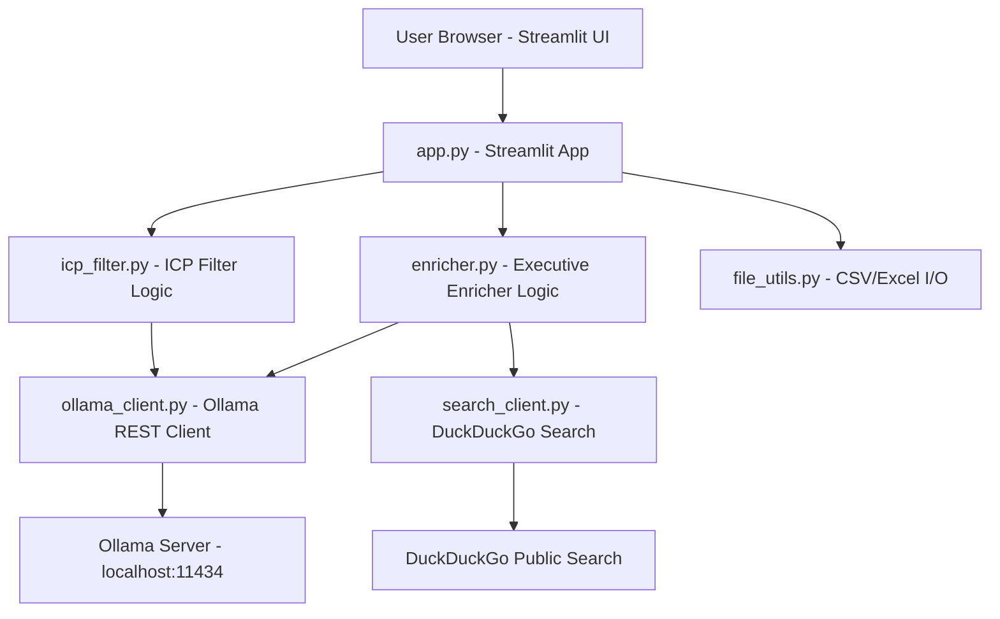

# Design Document: SalesCo-Pilot Free

## Overview

SalesCo-Pilot Free is a standalone Python/Streamlit application that provides two AI-powered sales productivity modules:

1. **ICP Filter Module** — Filters a company list against a plain-English Ideal Customer Profile using a local Ollama LLM.
2. **Executive Enricher Module** — Enriches a company list with CEO, Founder, Co-Founder, and Key Heads data using DuckDuckGo search + Ollama extraction.

The app runs entirely locally with no paid APIs, no API keys, and no external data services. It is designed for salespeople who want AI-assisted prospecting on their own hardware.

---

## Architecture



The app is structured as a single Streamlit entry point (`app.py`) that imports from focused utility modules. All processing is synchronous and single-threaded to keep the implementation simple and debuggable.

---

## Components and Interfaces

### `app.py` — Main Streamlit Application
- Renders sidebar navigation, global config (model selector, batch size)
- Calls `check_ollama()` on startup and shows status
- Routes to `render_icp_module()` or `render_enricher_module()` based on sidebar selection

### `ollama_client.py` — Ollama REST Client
```python
def check_ollama() -> tuple[bool, list[str]]:
    """Returns (is_running, list_of_model_names)"""

def query_ollama(model: str, prompt: str, timeout: int = 30) -> str:
    """Sends a prompt to Ollama /api/generate, returns response text"""
```

### `icp_filter.py` — ICP Filter Logic
```python
def build_icp_prompt(row: dict, icp_description: str) -> str:
    """Constructs the prompt sent to Ollama for ICP classification"""

def parse_icp_response(response: str) -> tuple[str, str]:
    """Parses LLM response into (match: 'YES'|'NO'|'UNKNOWN', reason: str)"""

def run_icp_filter(df: pd.DataFrame, icp_description: str, model: str,
                   batch_size: int, progress_callback) -> pd.DataFrame:
    """Processes all rows, returns df with ICP_Match and Match_Reason columns"""
```

### `enricher.py` — Executive Enricher Logic
```python
def build_search_queries(company_name: str) -> list[str]:
    """Returns list of DuckDuckGo search queries for a company"""

def build_enrichment_prompt(company_name: str, search_snippets: str) -> str:
    """Constructs the Ollama prompt for executive extraction"""

def parse_enrichment_response(response: str) -> dict:
    """Parses LLM response into enrichment field dict"""

def run_enrichment(df: pd.DataFrame, model: str,
                   progress_callback) -> pd.DataFrame:
    """Processes all companies, returns df with enrichment columns appended"""
```

### `search_client.py` — DuckDuckGo Search
```python
def search_company(queries: list[str], max_results: int = 5) -> str:
    """Runs DuckDuckGo searches and returns concatenated snippet text"""
```

### `file_utils.py` — File I/O
```python
def load_file(uploaded_file) -> pd.DataFrame:
    """Loads CSV or XLSX into a DataFrame"""

def to_csv_bytes(df: pd.DataFrame) -> bytes:
    """Serializes DataFrame to CSV bytes for download"""

def to_excel_bytes(df: pd.DataFrame) -> bytes:
    """Serializes DataFrame to Excel bytes for download"""

def find_company_column(df: pd.DataFrame) -> str | None:
    """Case-insensitive search for 'company' or 'company_name' column"""
```

---

## Data Models

### ICP Filter Output Schema
| Column | Type | Description |
|---|---|---|
| (all original columns) | any | Preserved from input |
| `ICP_Match` | str | "YES", "NO", or "UNKNOWN" |
| `Match_Reason` | str | One-sentence LLM explanation |

### Executive Enricher Output Schema
| Column | Type | Description |
|---|---|---|
| (all original columns) | any | Preserved from input |
| `CEO_Name` | str | CEO name or "Not Found" |
| `CEO_LinkedIn` | str | CEO LinkedIn URL or "Not Found" |
| `Founder_Name` | str | Founder name or "Not Found" |
| `Founder_LinkedIn` | str | Founder LinkedIn URL or "Not Found" |
| `CoFounder_Name` | str | Co-Founder name or "Not Found" |
| `Key_Heads` | str | Comma-separated "Role: Name" pairs or "Not Found" |

### Ollama API Request
```json
{
  "model": "llama3.2",
  "prompt": "<constructed prompt>",
  "stream": false
}
```

### Ollama API Response (relevant fields)
```json
{
  "response": "<LLM text output>"
}
```

---

## Correctness Properties

*A property is a characteristic or behavior that should hold true across all valid executions of a system — essentially, a formal statement about what the system should do. Properties serve as the bridge between human-readable specifications and machine-verifiable correctness guarantees.*

### Property 1: File loading preserves data

*For any* valid CSV or XLSX file with N rows and M columns, `load_file()` should return a DataFrame with exactly N rows and M columns, and the column names should match the file headers.

**Validates: Requirements 2.1, 2.2, 2.3**

---

### Property 2: ICP prompt contains row data and ICP description

*For any* company row (as a dict) and any non-empty ICP description string, `build_icp_prompt()` should return a string that contains both the ICP description text and at least one value from the row dict.

**Validates: Requirements 4.2, 4.3**

---

### Property 3: ICP response parser handles all inputs correctly

*For any* string that starts with "YES" (case-insensitive), `parse_icp_response()` should return `("YES", <non-empty reason>)`. For any string starting with "NO", it should return `("NO", <non-empty reason>)`. For any other string (including empty), it should return `("UNKNOWN", "LLM response could not be parsed")`.

**Validates: Requirements 4.4, 4.7**

---

### Property 4: ICP filter output preserves all original columns

*For any* input DataFrame with columns C, after running `run_icp_filter()`, the output DataFrame should contain all columns in C plus `ICP_Match` and `Match_Reason`.

**Validates: Requirements 4.4, 5.3**

---

### Property 5: ICP filter results contain only matching rows

*For any* output DataFrame from `run_icp_filter()`, filtering to only rows where `ICP_Match == "YES"` should return the same set of rows as the full output (i.e., non-matching rows are excluded from the returned filtered set).

**Validates: Requirements 4.5**

---

### Property 6: Search query construction contains company name and keywords

*For any* non-empty company name string, `build_search_queries()` should return a list of at least 3 queries, each containing the company name, and collectively covering the keywords: "CEO", "Founder", "leadership".

**Validates: Requirements 6.3**

---

### Property 7: Enrichment output schema is always complete

*For any* input DataFrame processed by `run_enrichment()`, the output DataFrame should contain all 6 enrichment columns: `CEO_Name`, `CEO_LinkedIn`, `Founder_Name`, `Founder_LinkedIn`, `CoFounder_Name`, `Key_Heads`.

**Validates: Requirements 6.6**

---

### Property 8: Missing enrichment fields default to "Not Found"

*For any* Ollama response string that does not contain a parseable value for a given enrichment field, `parse_enrichment_response()` should return "Not Found" for that field.

**Validates: Requirements 6.5**

---

### Property 9: Search failure resilience

*For any* company where `search_company()` raises an exception, `run_enrichment()` should still produce a row for that company with all enrichment fields set to "Search Failed", and processing should continue to the next company.

**Validates: Requirements 8.1**

---

### Property 10: LLM failure resilience

*For any* row where `query_ollama()` raises an exception or times out, the processing function should mark all LLM-dependent fields for that row as "LLM Error" and continue to the next row without raising.

**Validates: Requirements 8.2**

---

### Property 11: Company column detection is case-insensitive

*For any* DataFrame whose columns include a case variation of "company" or "company_name" (e.g., "Company", "COMPANY", "Company_Name"), `find_company_column()` should return the correct column name.

**Validates: Requirements 6.2**

---

### Property 12: Estimated processing time scales linearly

*For any* row count N and average LLM response time T (in seconds), the estimated processing time should equal N × T (within floating point tolerance).

**Validates: Requirements 9.3**

---

## Error Handling

| Scenario | Behavior |
|---|---|
| Ollama not running | Show error banner with `ollama serve` instructions; disable run buttons |
| No models in Ollama | Show instructions to run `ollama pull llama3.2` |
| Unsupported file type | Show error, halt processing |
| Empty file | Show warning, halt processing |
| Missing company column | Show error with column name hint |
| DuckDuckGo search fails | Mark row as "Search Failed", continue |
| Ollama timeout/error | Mark row as "LLM Error", continue |
| Unparseable LLM response | Mark as "UNKNOWN" / "Not Found", continue |
| No file uploaded before run | Show prompt to upload file |
| No ICP description entered | Show validation error |

---

## Testing Strategy

### Dual Testing Approach

Both unit tests and property-based tests are used. They are complementary:
- Unit tests verify specific examples, edge cases, and error conditions
- Property tests verify universal properties across many generated inputs

### Property-Based Testing Library

**pytest-hypothesis** (Hypothesis for Python) is used for all property-based tests.

Each property test runs a minimum of 100 iterations (Hypothesis default `max_examples=100`).

### Test File Structure

```
tests/
  test_file_utils.py       # Property 1, file loading
  test_icp_filter.py       # Properties 2, 3, 4, 5
  test_enricher.py         # Properties 7, 8, 9, 10, 11
  test_search_client.py    # Property 6
  test_ollama_client.py    # Unit tests for connectivity check
  test_app_utils.py        # Property 12, unit tests for validation
```

### Property Test Annotation Format

Each property test is tagged with:
```python
# Feature: salesco-pilot-free, Property N: <property_text>
```

### Unit Test Focus Areas

- Specific file format examples (CSV with headers, XLSX with multiple sheets)
- Edge cases: empty file, file with only headers, single-row file
- Error conditions: bad file type, missing company column, Ollama connection refused
- Integration: full ICP filter run with mocked Ollama responses
- Integration: full enrichment run with mocked search + Ollama responses

### Property Test Configuration

```python
from hypothesis import given, settings
from hypothesis import strategies as st

@settings(max_examples=100)
@given(...)
def test_property_N_description():
    # Feature: salesco-pilot-free, Property N: <text>
    ...
```
